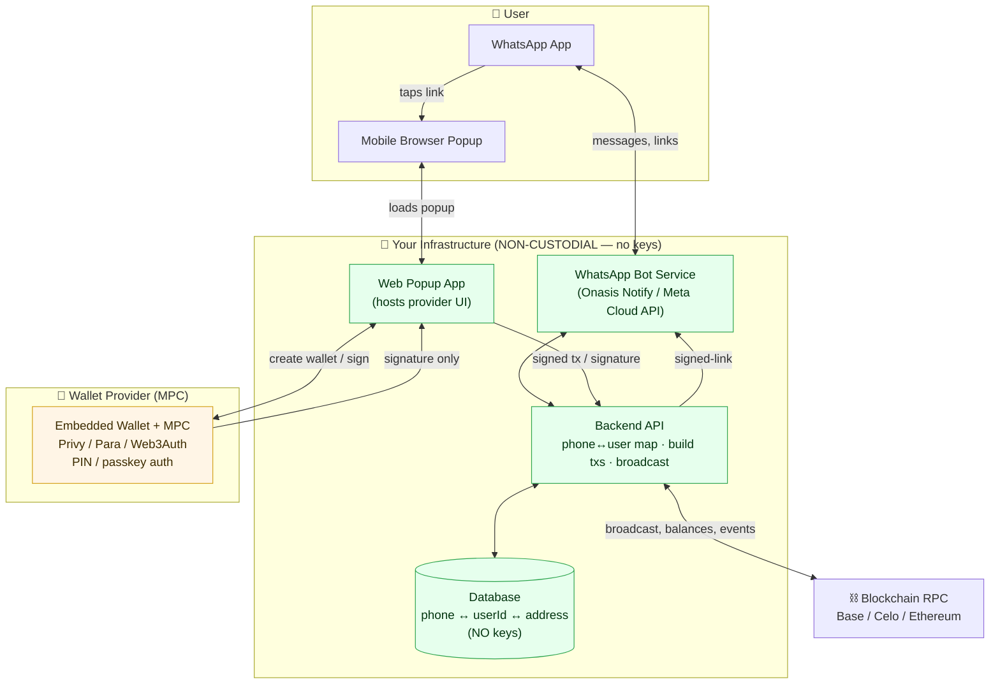
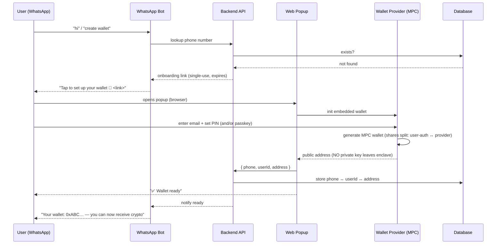
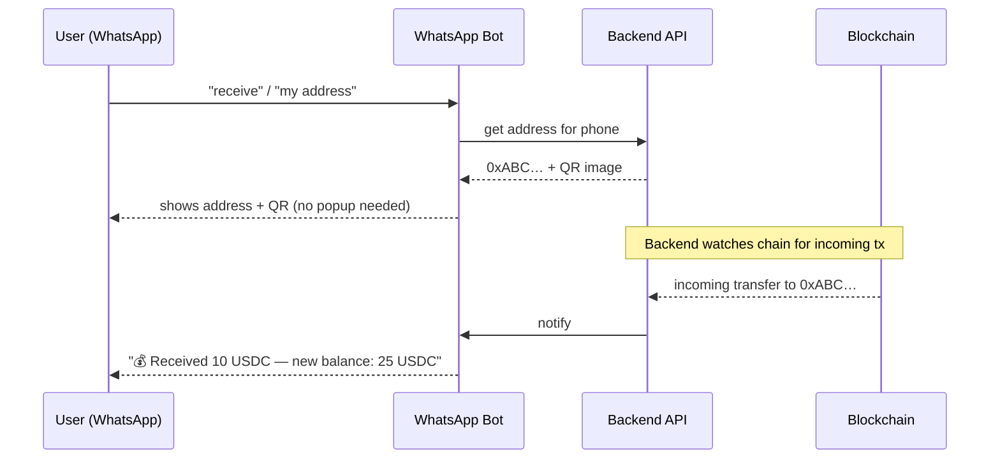
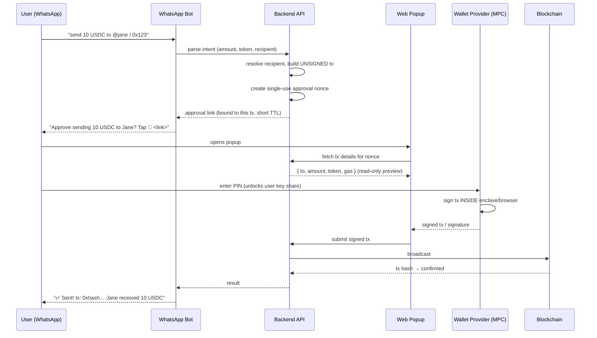

# WhatsApp Non-Custodial Crypto Wallet — Architecture

> **Concept:** A WhatsApp chatbot where users can send and receive crypto. Wallet
> creation and payment authorization happen in a lightweight **browser popup** opened
> from the chat, so signing always occurs on a surface the **user** controls.
> **Goal:** Fully **non-custodial** — the developer (you) never has access to the
> wallet's private key or seed.

- **Status:** Research / design
- **Last updated:** 2026-06-23
- **Owner:** Drip team

---

## 1. The core principle

> **WhatsApp is the _interface_. The browser popup is the _signing surface_.**

The single rule that keeps this non-custodial:

> **The user's PIN/password gates a key (or key share) that your backend NEVER sees.
> Signing happens inside the popup / provider enclave. Your server only ever receives
> a finished signature or a fully-signed transaction to broadcast.**

If you keep that rule, **you cannot move user funds** — which is the non-custodial guarantee.

### What "non-custodial" means here (honest scope)
- ✅ **You (the developer) hold no keys** — you can never sign on a user's behalf.
- ⚠️ The **wallet provider** (Privy / Para / Web3Auth) is in the trust path via MPC key
  shares. This is "non-custodial relative to you," not zero-trust self-custody.
- ❌ **Pure trustless self-custody** (user manages a raw seed phrase) is intentionally
  avoided — it would destroy the WhatsApp UX.

---

## 2. 🚨 Hard security rules (non-negotiable)

| # | Rule | Why |
|---|------|-----|
| 1 | **Never derive keys from a phone number.** Phone numbers are low-entropy, guessable, and SIM-swappable. | An attacker could regenerate the key or port the number and own the wallet. The phone number is an **identifier only**. |
| 2 | **Never send a private key or seed phrase over WhatsApp.** | The channel isn't yours; messages persist in chat backups and are a phishing magnet. |
| 3 | **PIN = "unlock", not "the key".** A 4–6 digit PIN must be combined with a provider-held share (MPC) or passkey. | A PIN alone is brute-forceable. MPC ensures PIN-guessing alone can never rebuild the wallet. |
| 4 | **Backend stores only: phone ↔ user-id ↔ public address.** Never key material. | Keeps the server out of custody. If your DB leaks, no funds are at risk. |
| 5 | **Every signing link is single-use, short-lived, and bound to one tx.** | Prevents replay / approval-phishing. |

---

## 3. System components

| Component | Responsibility | Holds keys? |
|-----------|----------------|:-----------:|
| **WhatsApp Bot** (Onasis Notify / Meta Cloud API / Twilio) | Chat interface: commands, balance, address/QR, "tap to approve" links | ❌ |
| **Backend API** (your server) | Phone↔user mapping, build unsigned txs, issue signed links, broadcast signed txs, listen to chain events | ❌ |
| **Web Popup** (thin web app) | Hosts the wallet provider's UI for create-wallet & approve-payment | ❌ (transient, in-browser only) |
| **Wallet Provider** (Privy/Para/Web3Auth) | MPC key shares, PIN/passkey auth, signing inside enclave/browser | 🔑 shares (split) |
| **Blockchain RPC** (Base/Celo/etc.) | Broadcast, balances, confirmations | n/a |
| **Database** | phone ↔ userId ↔ address, tx history, link nonces | ❌ keys |

---

## 4. High-level architecture diagram



> **Read the colors:** Green = your infra, holds **no keys**. Amber = the provider's
> MPC layer, which holds the **split** key shares. The arrow from `MPC → WEB` carries a
> **signature only**, never a key.

### ASCII fallback (if Mermaid doesn't render)

```
   ┌──────────── USER (phone) ────────────┐
   │  WhatsApp App        Browser Popup    │
   └─────┬───────────────────────┬─────────┘
         │ chat / links          │ taps approve-link
         ▼                       ▼
 ┌───────────────┐        ┌──────────────┐
 │  WhatsApp Bot │◄──────►│  Web Popup   │
 │ (Onasis/Meta) │        │  (provider   │
 └──────┬────────┘        │   UI host)   │
        │                 └──────┬───────┘
        ▼                        │ create / sign
 ┌───────────────┐               ▼
 │  Backend API  │        ┌──────────────┐
 │ map · build   │◄──────►│  Wallet      │  🔑 MPC key
 │ tx · broadcast│ sig    │  Provider    │   shares
 └──┬────────┬───┘        │ (Privy/Para) │   (split)
    │        │            └──────────────┘
    ▼        ▼
 ┌─────┐  ┌──────────────┐
 │ DB  │  │ Blockchain   │
 │(no  │  │ RPC          │
 │keys)│  │ Base/Celo... │
 └─────┘  └──────────────┘
```

---

## 5. Flow A — Onboarding / wallet creation



**Key point:** The only thing that crosses back to your backend is the **public address**.

---

## 6. Flow B — Receiving crypto (100% safe, no signing)



Receiving never requires a signature, so it's fully safe and needs no popup.

---

## 7. Flow C — Sending crypto (signing in the popup)



**Key point:** Your backend builds the **unsigned** tx and broadcasts the **signed**
one, but never sees the key. The PIN only unlocks the user's share inside the popup.

---

## 8. Provider comparison

| Provider | Why it fits | Custody model | Effort | Notes |
|----------|-------------|---------------|:------:|-------|
| **Privy** ⭐ | Already used in Drip; email login + PIN/passkey + MPC embedded wallets | MPC, non-custodial to you | Low | **Recommended** — least new infra |
| **Para** (ex-Capsule) | Purpose-built for embedded MPC wallets via popup/modal across apps | MPC + passkey/PIN | Low–Med | Best-in-class popup UX |
| **Web3Auth** | Mature MPC, social/email + PIN recovery factor | MPC (threshold) | Med | Very flexible, more config |
| **Turnkey** | Passkey-first, low-level primitives | TEE + passkey policies | High | Most control, build more UX |
| **Magic / Dynamic** | Simple email-login embedded wallets | varies | Low | Less MPC flexibility |

### Recommendation: **Privy**
- Already running in Drip → team familiarity, shared config.
- Out-of-the-box email-login + PIN/passkey embedded-wallet MPC flow.
- Maps cleanly onto the popup model.

---

## 9. What you actually build

1. **WhatsApp Bot** — message handling, commands, link delivery.
   - Options: **Onasis Notify** (notify.onasis.tech), Meta WhatsApp Cloud API (official), or Twilio.
2. **Web Popup app** — a thin page hosting the Privy (or Para) widget for two actions:
   create-wallet and approve-payment.
3. **Backend API** — phone↔user mapping, intent parsing, build/broadcast txs, issue
   single-use signed links, watch chain for incoming funds.
4. **Database** — `phone ↔ userId ↔ address`, tx history, link nonces. **No keys.**

### Suggested command set (bot UX)
| Command | Action | Needs popup? |
|---------|--------|:------------:|
| `hi` / `start` | Onboard or greet | ✅ (first time) |
| `balance` | Show balances | ❌ |
| `receive` / `address` | Show address + QR | ❌ |
| `send <amount> <token> to <recipient>` | Build tx + approval link | ✅ |
| `history` | Recent txs | ❌ |
| `help` | Command list | ❌ |

---

## 10. Open design decisions (decide before building)

| Decision | Options | Recommendation |
|----------|---------|----------------|
| **Auth factor for approval** | PIN vs Passkey (Face ID/fingerprint) | Offer **PIN**, allow **passkey** upgrade (less phishable) |
| **Account recovery** (forgot PIN) | Provider recovery factor, email recovery, social recovery | Use provider's recovery factor (Privy/Web3Auth); document the UX |
| **Chain(s)** | Base, Celo, Ethereum, etc. | Pick low-fee chain (Base/Celo) — gas matters for small transfers |
| **Gas handling** | User pays gas vs sponsored (paymaster/AA) | Consider **gas sponsorship** so users don't need native token |
| **Recipient resolution** | Phone number, @username, raw address | Support phone (lookup) + raw address |
| **Spending limits / policies** | Per-tx, daily caps | Use provider policies for safety |

---

## 11. Threat model — quick checklist

- [ ] Phone number is **identifier only**, never key material (SIM-swap safe by design).
- [ ] No private key / seed ever transmitted over WhatsApp.
- [ ] Approval links are **single-use, short-TTL, bound to one tx** (anti-phishing/replay).
- [ ] Backend DB contains **no key material** — leak ≠ loss of funds.
- [ ] PIN combined with MPC share (never PIN alone).
- [ ] Tx preview shown in popup before signing (user sees real amount + recipient).
- [ ] Rate-limit bot commands; verify WhatsApp sender identity.
- [ ] Recovery flow defined and tested.

---

## 12. Reality check — what's easy vs hard

| Capability | Difficulty | Notes |
|------------|:----------:|-------|
| **Receiving** crypto, non-custodial | 🟢 Easy | Only ever show an address/QR |
| **Sending** crypto, non-custodial | 🟡 Medium | Requires user approval in popup (by design) |
| **Wallet from phone number** | 🟢 Easy | Phone = identifier; real keys via MPC provider |
| **Account recovery** | 🔴 Hardest | The core UX problem of non-custodial — solve early |
| **Pure type-and-send (no popup)** | ❌ Impossible non-custodially | That would be custodial by definition |

---

## 13. Next steps

1. Decide **Privy vs Para** (recommend Privy given existing Drip integration).
2. Choose **chain** + gas strategy (sponsored vs user-paid).
3. Decide **PIN vs passkey** and the **recovery** flow.
4. Prototype the **web popup** (create-wallet + approve-payment) against Privy.
5. Wire the **WhatsApp bot** (Onasis Notify or Meta Cloud API) → backend → popup.
6. Build the **chain watcher** for incoming-funds notifications.

---

*Document generated for research/design purposes. No keys, secrets, or production
config are included.*
